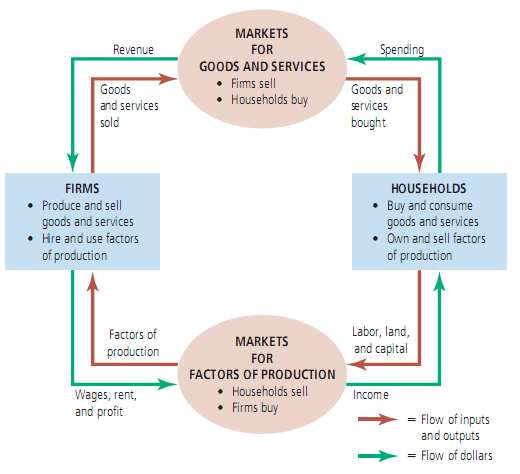
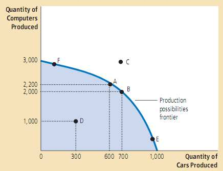
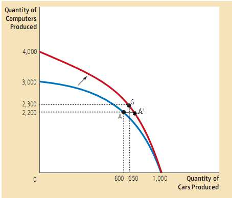

# 像经济学家那样思考

## 2.1 作为科学家的经济学家 ##

### 2.1.1 科学的方法：观察、提出理论和继续观察 ###
&emsp;&emsp;由于不能在实验室里做实验，经济学家通常格外关注历史提供的自然实验。

### 2.1.2 假设的作用 (the role of assumptions) ###
&emsp;&emsp;假设可以简化复杂的世界，可使世界 更容易理解。

### 2.1.3 经济模型 ###
&emsp;&emsp;所有模型，不管是物理、生物还是经济学中的模型，都对现实进行了简化，目的是让我们更好地了解现实。

### 2.1.4 我们的第一个模型：循环流向图 ###

* **循环流向图** (circular-flow diagram) ：一个直观经济模型，它说明了货币是如何通过市场在家庭和企业之间流动的。

  

### 2.1.5 我们的第二个模型：生产可能性边界 ###

* **生产可能性边界** (production possibility frontier) 是一个描述产出品各个可行组合的图形，准确地说，它描述的是在生产要素和生产技术既定的情形下，经济能够生产出的产品组合。生产可能性边界简化了复杂的经济，它可以说明一些基本但有力的思想：稀缺、效率、 权衡、机会成本和经济增长。  
>这个例子是汽车和计算机产量的各个组合。  
A,B,E,F点充分利用资源，可以说是**有效率的** (efficient)。  
C点表示目前条件下，该经济的生产要素数量不足以生产C点代表的汽车和计算机组合。  
D点表示**无效率的** (inefficient)。  
商品的机会成本与生产可能性边界的斜率相关。对于汽车，在点F，生产可能性边界很平缓，此时一辆车的机会成本很小(减少生产少量计算机即可生产一辆汽车)，而在点E，生产可能性边界很陡峭，一辆车的机会成本很大。  
  
**生产可能性边界的移动**计算机行业的技术进步使得对于给定的汽车产量上，社会都能生产更过的汽车。结果，生产可能性边界向外移动。如果经济从A点移动到G点，那么汽车和计算机的产量都增加了。  
  

### 2.1.6 微观经济学和宏观经济学 ###
* **微观经济学** (microeconomics) 研究的是家庭和企业如何做出决策以及他们如何在特定市场上相互作用的。
* **宏观经济学** (macroecnomics) 则研究整个经济范围的现象。
>微观经济学家可能研究下列事情：租金控制对纽约住房市场的影响；别的国家与美国竞争对美国汽车行业的影响；义务教育制度对他们就业后的收入影响。宏观经济学家研究的是，例如：美国联邦政府借债的效应；国家失业率在某时期内的变动；或促进国民生活水平提高的不同政策等。  

## 2.2 作为政策顾问的经济学家 ##

### 2.2.1 实证分析和规范分析 ###

* **实证性陈述** (positive statements) 是描述性的 (descriptive) 。他们断言世界**是**怎样的。
* **规范性陈述** (normative statements) 是规定性的 (prescriptive) 。

### 2.2.2 华盛顿首府的经济学家 ###

### 2.2.3 为何经济学家的意见并非总能被接受 ###

## 2.3 为何经济学家们的观点不一致 ##
&emsp;&emsp;为什么经济学家们为政策制定者提出的意见通常是冲突的？基本原因有两个：
* 在世界是如何运行问题上存在多种实证性理论，经济学家们互相难以说服对方。
* 经济学家们的价值观可能不同，因此对于应该实施什么样的政策这类规范性问题看法不一。

### 2.3.1 科学判断上的差异 ###
>例如，经济学家们对下列问题观点不一致：政府应该对家庭的收入征税还是对家庭的消费（支出）征税。部分经济学家主张应该将当前的收入税改为消费税，理由是他们相信这一改变能鼓励家庭多储蓄，因为储蓄不需缴税。高储蓄使得用于资本积累的资源增加，从而导致生产力和生活水平的更快增长。主张保留当前收入税体系的经济学家认为，家庭储蓄对于税收法律变动的反应不足。**这两组经济学家对于税收体系所持的规范性观点不同**，因为他们对于储蓄对税收激励的反应程度持有的实证性观点不同。

### 2.3.2 价值观上的差异 ###

### 2.3.3 观念与现实 ###

## 2.4 我们出发吧 ##
&emsp;&emsp;本书前两章介绍了经济学的思想和方法。

## 附录A ##
&emsp;&emsp;两个会导致分析错误的原因：
* **遗漏的变量** (omitted variable) ：变化是由没有考虑到的第三方变量引起的。
* **反向因果** (reverse causality) ：我们已经正确识别出两个变量，我们认为A导致B，但实际上是B导致了A。
>**遗漏的变量**：通过调查发现家里打火机越多，患癌症可能性更高，但实际上是吸烟使得家里打火机多，进而导致患癌症可能性更高。  
**反向因果**：通过调查发现警察越多的地方罪犯越多，实际上是因为罪犯多警察才更多。(通过时间先后判断，先发生为原因，后发生为结果)
