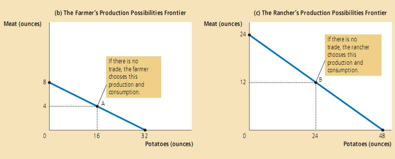

# 第三章：相互依赖性与贸易的好处 #

## 3.1.1 生产可能性 ##

>例子：农夫与牧场主(不进行交易)  
  
  

## 3.1.2 专业化与交易 ##

>例子：农夫与牧场主(进行交易)  
  
  
交易如何扩大了**消费机会集** (sets of consumption opportunities) 。如果两人按照表中，他们都得到了更好的消费组合。  

## 3.2 比较优势：专业化的驱动力 ##

### 3.2.1 绝对优势 ###

* **绝对优势** (absolute advantage) ：在某种商品的生产上，哪个生产者的投入越少，我们就说此生产者在该商品得生产上具有比较优势。

### 3.2.2 机会成本和比较优势 ###

* **比较优势** (comparative advantage) :在生产产品X时，哪个生产者放弃的其他商品越少，该生产者生产产品X的机会成本越小，我们就说他在产品X的生产上具有比较优势。  
* 尽管一个生产者可能在两种(所有)产品的生产上都具有**绝对优势**（例如本例中的牧场主），但任何生产者都不可能在这两种(所有)产品的生产上都具有**比较优势**。
>&emsp;&emsp;假设有A和B两样产品，有P和Q两个人，P生产一单位的A的机会成本是个B产品，Q生产一单位的A的机会成本是个B产品,因此P和Q生产一单位的B产品的机会成本分别为和。  若某生产者在两种产品上都具有**比较优势**，此处假设他为P，则要满足下列不等式组，显然无法成立。  
>

### 3.2.3 比较优势和交易 ###
* 专业化和交易的好处不是源于绝对优势而是源于比较优势。
* 交易可使社会中的每个人得到好处，因为交易能让人们专业从事自己具有比较优势的活动。

## 3.2.4 交易的价格 ##
* 一个一般性的规则：对于得到交易好处的交易双方来说，交易的价格必定介于他们的机会成本之间。
>比如上述例子，假如1单位牛肉换5单位土豆，那双方只会生产牛肉，那就不会有交易产生。  
>假如1单位牛肉换1单位土豆，那双方都会生产土豆，也不会有交易产生。  

## 3.3 比较优势的应用 ##
&emsp;&emsp;略

## 3.4 总结 ##
* 每个人消费的商品和服务，都是由美国和全世界其他国家的很多人生产的。相互依赖性和交易是有好处的，因为它们使得每个人享受的商品及服务的数量和种类都增加了。  
* 比较两个人生产某种商品能力大小的方法有两种。在该商品的生产上：谁的投入较小谁就具有绝对优势；谁的机会成本较小谁就具有比较优势。交易的好处是基于比较优势而非绝对优势之上的。  
* 交易使得每个人的状况变好，这是因为交易可让人们专业从事他们具有比较优势的活动。  
* 比较优势原理不仅适用于个人，也适用于国家。经济学家使用比较优势原理来为国家间的自由贸易辩护。  

