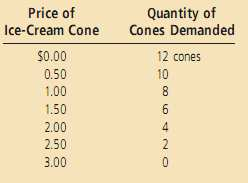
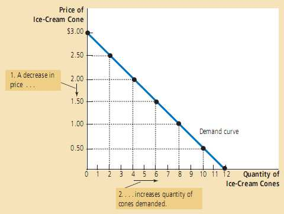
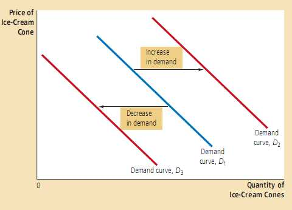
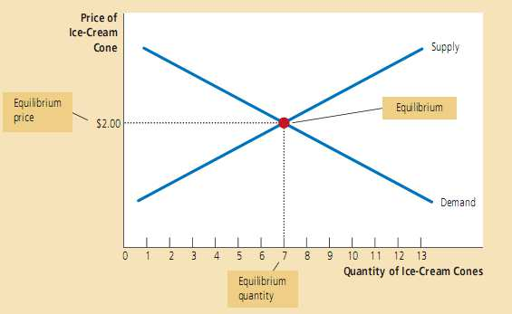

# 供给和需求的市场力量 #
&emsp;&emsp;**供给**和**需求**是使市场经济运行的力量。它们决定了每种商品的产量和销售价格。如果你想知道任何事件或政策将会对经济产生什么样的影响，你必须首先考虑它会对供给和需求产生什么样的影响。

## 4.1.1 什么是市场？ ##
&emsp;&emsp;**市场** (market) 是由某种商品或服务的买者和卖者组成的。买者群体决定了产品的需求，卖者群体决定了产品的供给。

## 4.1.2 什么是竞争？ ##

&emsp;&emsp;如果某种产品的市场上充斥着大量的买者和大量的卖者，但每个买者或卖者对市场价格的影响都是微不足道的，经济学家通常将这样的市场称为**竞争(性的)市场** (competitive market) 。
>&emsp;&emsp;冰淇淋的每个卖者对价格的控制力非常有限，这是因为其他卖者提供了类似的产品。每个卖者没有理由索要比现行价格更低的价格，但如果他索要的价格高于现行价格，买者就会到其他卖者那儿购买。类似地，冰淇淋的单个买者对价格也没影响力，因为他购买的数量占市场上冰淇淋总数的比例非常小。

市场是**完全竞争的** (perfectly competitive) 需要满足两个特征：  
* (1) 不同卖者提供的商品是**相同**的；
* (2) 买者和卖者的数量充分多以至于**单个**买者或者卖者对市场价格无任何影响力。

由于完全竞争市场的买者和卖者必须接受市场决定的价格，经济学家将他们称为**价格接受者** (price taker) 。  
某些商品的市场只有一个卖者，这个卖者制定价格。这样的卖者称为**垄断者** (monopoly)。 

## 4.2 需求 ##

### 4.2.1 需求曲线：表明价格和需求量之间关系的曲线 ###
* **需求量** (quantity demanded)：买者们愿意且有能力购买的某商品数量。
* **需求定律** (law of demand)：在其他条件不变时，某商品的价格上升，该商品的需求量下降，当它的价格下降时，需求量上升。
* **需求表** (demand schedule)：表示某商品的价格和其需求量之间的关系的表格表示某商品的价格和其需求量之间的关系的表格。
* **需求曲线** (demand curve)：表示某商品的价格和其需求量之间关系的图形。
>凯瑟琳对冰淇淋的需求表和需求曲线。  

### 4.2.2 市场需求和个人需求 ###

**市场需求** (market demand) 是指某产品或服务的所有需求的加总。

### 4.2.3 需求曲线的移动 ###

* **需求增加** (increase in demand) 会导致需求曲线右移。  
* **需求减少** (decrease in demand) 会导致需求曲线左移。  
>   

会导致需求曲线移动的一些重要变量：
>* **收入**
>>如果收入下降某种商品的需求也下降，这种商品称为**正常商品** (normal good)。  
>>如果收入下降但某种商品的需求上升，这种商品称为**低档商品** (inferior good)。  
>* **相关商品得价格**
>>若一种商品的价格下降减少了另外一种商品的需求，这两种商品称为**替代品** (substitutes)。  
>>若一种商品价格下降增加了另外一种商品的需求，这两种商品称为**互补品** (complements)。  
>* **品味**
>* **预期**
>* **买方的人数**

### 4.3 供给 ###

### 4.3.1 供给曲线：表明价格和供给量之间关系的曲线 ###

* 某商品或服务的**供给量** (quantity supplied) 是卖方原意且有能力出售的数量。
* **供给定律** (law of supply) ：其他条件不变的情形下，当某商品的价格上升时，该商品的供给量也上升，当它的价格下降时，该商品的供给量也下降。
* **供给表** (supply schedule) ：表示某商品的价格和其供给量之间关系的表格。
* **供给曲线** (supply curve) ：表示某商品的价格和其供给量之间关系的曲线。

### 4.3.2 市场供给与个人供给 ###

* 市场供给是个人供给之和。

### 4.3.3 供给曲线的移动 ###

* **供给** (increase in supply) 会导致供给曲线右移。  
* **供给** (decrease in supply) 会导致供给曲线左移。  
* 会导致供给曲线移动的一些重要变量：
>* **投入品的价格**
>* 技术
>* 预期
>* 卖方的人数

## 4.4 需求与供给的共同作用 ##

### 4.4.1 均衡 ###

&emsp;&emsp;将市场供给曲线和市场需求曲线画在一起。两条曲线交点成为市场的**均衡** (equilibrium)。该交点的价格成为**均衡价格** (equilibrium price)，该交点处的数量成为**均衡数量** (equilibrium quantity)。
**在均衡价格水平上，买方愿意且能够购买的某商品数量，正好等于卖方愿意且能够出售的该商品的数量。**均衡价格有时也成为**市场出清价格** (market-clearing price)。
> 

&emsp;&emsp;供给大于需求时，称为**过剩** (surplus) 或者**超额供给** (excess supply)。需求大于供给时，称为**短缺** (shortage) 或**超额需求** (excess demand)。

### 4.4.2 分析均衡变动的三个步骤 ###
1. 确定事件移动的是供给曲线还是需求曲线（或者使这两个曲线都移动）；
2. 确定曲线的移动方向。
3. 使用供给和曲线图分析曲线移动对均衡价格和均衡数量的影响。

## 小结 ##
价格变化的表现为沿着需求曲线和供给曲线运动 (movement)，不会导致需求曲线和供给曲线移动(shift)！！  
需求变化指的需求曲线移动，不等于需求量变化 (沿着曲线的运动)，供给变化同理。
>**供给和需求变动时，均衡价格 ( P )和均衡数量 ( Q )如何变动** 
>|           | 供给不变     | 供给增加       | 供给下降       | 
>|:---------|:-------------|:---------------|:---------------|
>| 需求不变 | P不变、Q不变 | P下降、Q上升   | P上升、Q下降   | 
>| 需求增加 | P上升、Q上升 | P不明确、Q上升 | P上升、Q不明确 | 
>| 需求减少 | P下降、Q下降 | P下降、Q不明确 | P不明确、Q下降 | 

