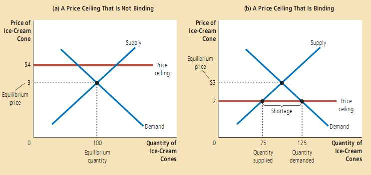
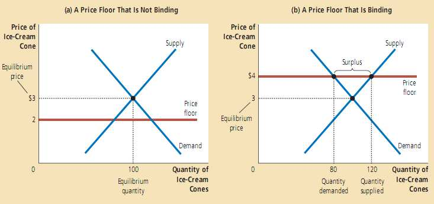
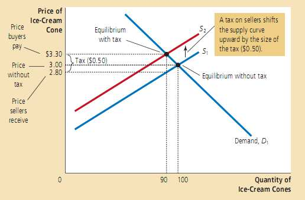
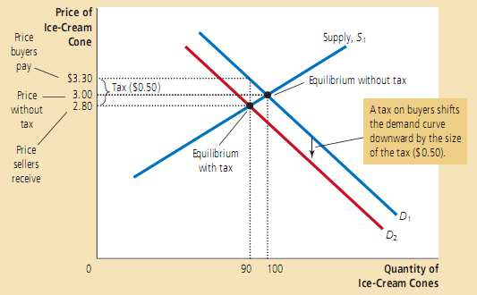
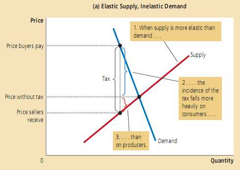
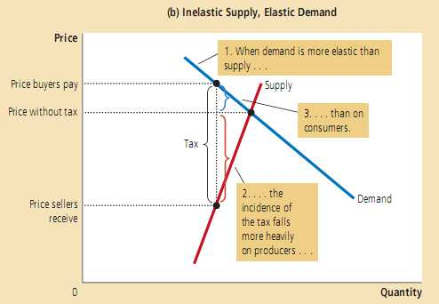

# 供给、需求和政府政策 #
&emsp;&emsp;政策产生的某些效应，通常出乎设计者的意料之外或者并非设计者的本意。
## 6.1 价格管制 ##
* **价格上限** (price ceiling) ：某商品的法定最高售价，市场价格不得超过该价格水平。
* **价格下限** (price floor) ：某商品的法定最低售价，市场价格不得低过该价格水平。

### 6.1.1 价格上限对市场结果的影响 ###

&emsp;&emsp;如果上限价格高于均衡价格，则它对市场的约束**不紧** (not binding)。否则，该上限是市场的**紧约束** (binding constraint)。**若政府对完全竞争市场规定了紧的价格上限，市场会出现商品短缺现象，卖方必须在大量潜在的的消费者中配给这种稀缺商品。**
>   
> 上面左图对市场并没有太大影响；而右图由于价格上限的存在，会导致供应小于需求，本是为有利于消费者而制定的政策却导致不利于消费者的结果。

### 6.1.2 价格下限对市场结果的影响 ###
&emsp;&emsp;类似于价格上限，**紧的价格下限造成了商品过剩**。
>   

### 6.1.3 对价格管制的评价 ###
&emsp;&emsp;当政策制定者通过立法设定价格时，他们就掩盖了正常的价格信号，而正是这样的信号指引着社会资源的配置。政策制定者之所以进行价格管制是因为他们认为市场结果是不公平的。价格管制的目的通常是帮助穷人。然而价格管制通常伤害了他们本来想帮助的人。帮助穷人的方法有多种，不必局限于价格管制。
>&emsp;&emsp;租金管制法试图让每个人都能住得起房子，最低工资法试图让人们摆脱贫困。租金管制可能让租金维持在比较低的水平上，但它同时也打击了房东维修现有住房的积极性，并且使得住房难以找到。最低工资法可能提高了某些人的工资，但也许导致了另外一些人失业。  
>&emsp;&emsp;帮助穷人的方法：政府可为穷人家庭负担一部分房租从而让他们可以租得起房子。工资补贴的一个例子是劳动收入税收抵免（earned income tax credit），这是政府实施的用来补贴低工资职工收入的一种项目。

&emsp;&emsp;尽管这些政策通常比价格管制好，但是它们也不是完美的。租金和工资补贴需要政府花钱，因此政府可能提高税收。我们在下一节将看到，征税本身也有代价。

## 6.2 税收 ##
&emsp;&emsp;**税收归宿** (tax incidence) ：市场参与方分摊税收负担的方式。

### 6.2.1 征收销售税对市场结果的影响 ###
* 尽管是由卖方将全部税收送给政府，但税收是由买卖双方分摊的。
* 征税打击了市场活动。当政府对某种商品征税后，新的均衡时的该商品的交易量下降了。
* 税收负担由买卖双方分摊。在新的均衡处，买方支付了更高的价格，而卖方得到了更低的价格。
>   
> 由于税收导致了供给曲线的移动，平衡价格和平衡需求量发生变化，导致商品价格上升，最终税收是买卖双方分摊。

### 6.2.2 征收消费税对市场结果的影响 ###
* 无论是征收消费税还是销售税，都是等价的,一旦市场达到新的均衡，买卖双方共同分摊税收(不一定是对半分)，无论税收是向哪一方征收的
* 其余结论和6.2.1一样
>   

### 6.2.3 弹性与税收归宿 ###
买卖双方之间分摊的一般规则：**税收负担中的大部分由相对缺乏弹性的一方承担。**
>   
>   
> 税收分摊在弹性小的一方  

## 6.3 结论 ##
&emsp;&emsp;略
