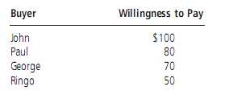
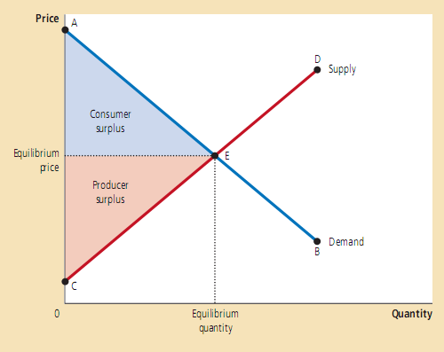

# 消费者、生产者和市场的效率 #
&emsp;&emsp;**福利经济学** (welfare economics)： 研究资源配置如何影响经济状况的一门学问。

## 7.1 消费者剩余 ##

### 7.1.1 支付意愿 ###
<!--&emsp;&emsp;**支付意愿** (willingness to pay) 买者对某商品愿意支付的最高钱数。-->
* **支付意愿** (willingness to pay) 买者对某商品愿意支付的最高钱数。
* **消费者剩余** (consumer surplus) ：买者对某商品得支付意愿减去实际支付的钱数。
>&emsp;&emsp;假设这是一个拍卖会，下表是每个人的支付意愿。那么最终会有John获得这个商品，而且支付价格为80\$,John的消费者剩余为20\$。  
> 

### 7.1.2 用需求曲线衡量消费者剩余 ###
&emsp;&emsp;**需求曲线以下价格线以上的面积衡量了市场的消费剩余。**

### 7.1.3 价格下降如何提高了消费者剩余 ###
>&emsp;&emsp;从需求曲线分析，价格下降后需求曲线以下，价格线以上的面积增加了。

### 7.1.4 消费者剩余衡量的是什么 ###
&emsp;&emsp;我们发展出消费者剩余这个概念的目的，是对市场结果的合意性进行评价。它衡量的是买者从商品身上得到的利益，而且**买者自己也是这么认为的**。在某些情形下，政策制定者宁可选择不关心消费者剩余，因为他们认为驱动某些买者行为的特殊偏好不值得尊重。消费者是自己福利的最好判断者，应该由他们判断自己从购买的商品上得到的利益。

## 7.2 生产者剩余 ##

### 7.2.1 成本与销售意愿 ###
* **成本** (cost) :未生产商品，卖者(生产者)必须放弃的其他东西的价值。
* **生产者剩余** (Producer surplus) :卖者(生产者)出售商品的收入减去其成本。

### 7.2.2 用供给曲线衡量生产者剩余 ###
* **价格线以下供给曲线以上区域的面积衡量市场中的生产者剩余。**

### 7.2.3 价格上升如何增加了生产者剩余 ###
>&emsp;&emsp;从供给曲线分析，价格上升后供给曲线以上，价格线以下的面积增加了。

## 7.3 市场效率 ##

### 7.3.1 仁慈的社会计划者 ###
&emsp;&emsp;消费者剩余和生产者剩余之和成为**总剩余** (total surplus) 。总剩余=商品对买者的价值-卖者的成本。如果某个资源配置使得总剩余最大，我们就说该配置体现了**效率** (efficiency) 。

### 7.3.2 对市场均衡的评价 ###
>  
>市场均衡时的消费者和生产者剩余

&emsp;&emsp;均衡结果是有效率的资源配置。

