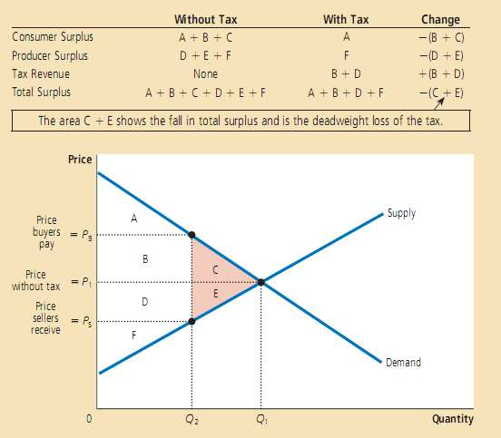
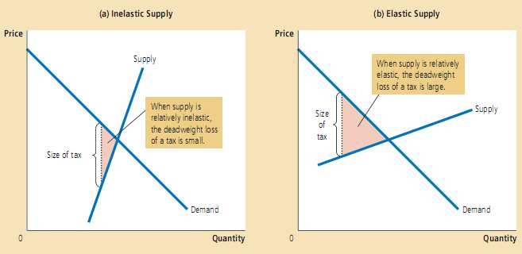
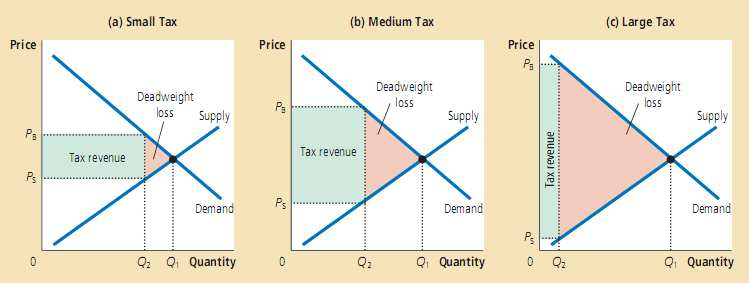
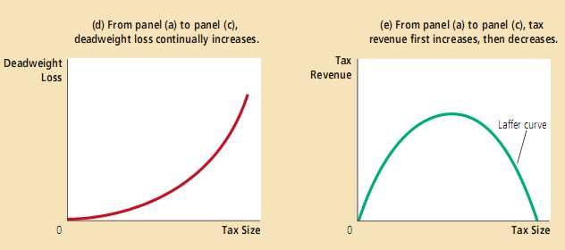

# 应用：征税的代价 #

## 8.1 征税造成的净损失 ##
&emsp;&emsp;**征收商品税对于买卖双方造成的损失，超过了政府筹集到的税收收入**，由征税或其他政策导致的总剩余下降，成为**净损失** (deadweight loss) 。
>&emsp;&emsp;下表为一个例子，为征税前平衡点，
>为征税后平衡点(在此没有画出需求或供给曲线的移动)，可以发现征税后总剩余减少了
>。  
>

## 8.2 净损失的决定因素 ##
&emsp;&emsp;**供给和需求的弹性越大，征税造成的净损失越大**。
> 
> 

## 8.3 单位税额变动对净损失和税收收入的影响 ##
&emsp;&emsp;**征税的净损失增加速度大于单位税额的增加速度。**
>   
>   
